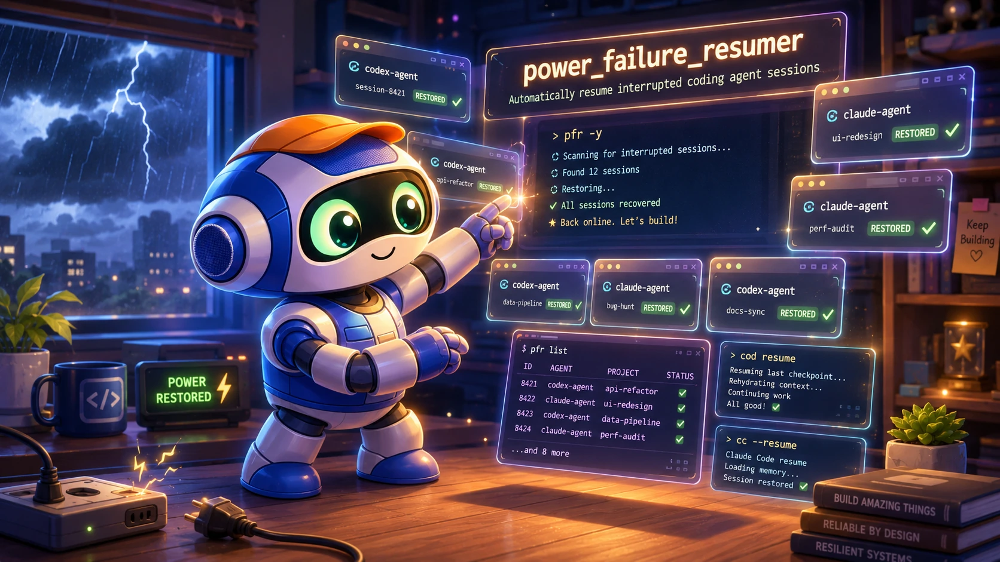

<div align="center">
  
</div>

<div align="center">

# power_failure_resumer

**When a power failure kills your terminal mid-swarm, get every Codex and Claude Code session back in one command.**

[](LICENSE)
[]()
[]()

```bash
curl -fsSL "https://raw.githubusercontent.com/Dicklesworthstone/power_failure_resumer/main/install.sh?$(date +%s)" | bash
```

</div>

---

## TL;DR

### The Problem

You run a fleet of local coding agents (Codex CLI and Claude Code) in Ghostty tabs. A power cut or hard reboot kills the terminal and every session in it. The transcripts survive on disk, but reconstructing *which* twenty sessions were live at the moment of death, in which project directories, with which resume ids, is slow manual work at exactly the wrong time.

### The Solution

A power cut leaves a forensic signature: every process that was mid-write stops touching its session file at nearly the same wall-clock moment, just before the next boot time. `pfr` scans Codex and Claude Code session files, finds that simultaneous-death cluster, scores how likely it is to be a real crash, and reopens each victim in its own Ghostty tab. Every tab launches its resume command (`cod resume <id> -m <recorded-model>`) directly in an interactive login shell, so your aliases apply and each session comes back on the model it was actually using.

### Why use pfr?

| Feature | What you get |
|---------|--------------|
| Crash-cluster detection | Pre-boot mtime clustering with densest-pocket isolation; idle sessions from earlier stay out |
| Confidence scoring | `high` / `medium` / `low` with printed reasons; a busy afternoon's file activity never scores `high` |
| Already-running skip | Sessions you resumed by hand are found in `ps` and not opened twice |
| Plans | Discovery writes `last-plan.json`; inspect once, open later, repeatably |
| Post-open verification | Polls `ps` for resume evidence, writes `last-report.json`, exits non-zero on silent failures |
| Tab order | Live status-log tab, agent-mail tab, hub projects, then the rest |
| Titles + previews | Each session shows its title and first user message, so you know what you're resuming |
| Model-matched resume | Each session resumes with its recorded model and reasoning effort (`-m` / `--model` pinned), so Codex never warns about a model mismatch |
| ntm-aware | Sessions spawned by [ntm](https://github.com/Dicklesworthstone/ntm) tmux swarms are excluded by default, attributed via ntm's send history, swarm manifests, checkpoint session bindings, and a narrow addressed-as-a-pane phrasing check; `--include-ntm` overrides |
| Fast bulk open | All tabs open in one scripting call, each running its resume command directly; no typing, no per-tab settle |
| Doctor | `pfr --doctor` catches missing permissions and dependencies before they waste a recovery |
| Offline tests | 16 suites against generated fixtures, including an install-then-run e2e through the real installer and launcher; no Ghostty, network, or live agents needed |

## Quick example

```console
$ pfr --dry-run
› boot time:     2026-08-03 16:22:58
› cluster mode:  pre_boot
› anchor mtime:  2026-08-03 16:22:49
› matched:       4 session(s)  (from 20 recent candidates)
› confidence:    high  (mode=pre_boot, cluster_size=4, anchor_gap_to_boot=9.0s, pre_boot_tight_pocket)
› skipped:       19 ntm-spawned session(s)  (--include-ntm to include)

──── sessions to resume ────
 1. codex   16:22:49     ~/projects/frankenterm
      cod resume 019fa4a7-3665-7aa3-8633-2a47c42c1d78 -m gpt-5.6-sol -c model_reasoning_effort=ultra
      » First read ALL of the AGENTS.md file and README.md file super carefully…
 2. claude  16:22:49     ~/projects/frankensim
      cc --resume ba9de0d5-51bb-40f8-9029-8ea3bcfc3481 --model claude-fable-5
      (Review project for bugs and improvements)
      » study this project and look for bugs…
 ...
› plan saved: ~/.local/state/pfr/last-plan.json  (confidence=high, 4 sessions)
› next: pfr --last-plan -y   or   pfr --last-plan --pick

$ pfr --last-plan -y     # open the whole batch, verify against ps, write the report
```

## Design philosophy

1. **mtime is the death signal.** Content timestamps say what a session talked about; file mtime says when its process stopped writing. Clustering runs on mtime alone.
2. **Discover once, open later.** Rediscovery drifts: sessions age, some get resumed by hand, new work starts. Plans freeze the decision so opening is repeatable.
3. **Cluster first, filter second.** Already-running sessions are dropped *after* the crash pocket is chosen, so filtering cannot shift the cluster onto an unrelated burst of activity.
4. **Never claim success without evidence.** Every open is checked against `ps`; a tab that silently shows a bare shell is a reported failure.
5. **Your shell, your aliases.** Resume commands run in a real interactive login shell, and each one pins the model and reasoning effort recorded in the session's own transcript, so a session recorded on one model never silently resumes on another.
6. **Swarm sessions belong to the swarm manager.** Panes spawned by ntm die and recover as a swarm; pfr leaves them out unless told otherwise, so a twenty-tab recovery does not bury your four hand-typed sessions under sixteen orphaned panes.

## How it compares

| | pfr | Ghostty window restore | tmux-resurrect | Manual `ls -lt` archaeology |
|---|---|---|---|---|
| Restores the agent conversation | yes (`cod resume` / `cc --resume`) | no (empty shells) | no (empty panes) | eventually |
| Knows which sessions died in the crash | yes (pre-boot clustering) | no | no | you, by hand |
| Skips ones already brought back | yes (via `ps`) | no | no | your memory |
| Judges whether it was a real crash | yes (scored, with reasons) | no | no | no |
| Survives a hard power cut | yes | partial | only if saved beforehand | yes |

## Install

**One-liner:**

```bash
curl -fsSL "https://raw.githubusercontent.com/Dicklesworthstone/power_failure_resumer/main/install.sh?$(date +%s)" | bash
```

Installs to `~/.local/share/pfr` and symlinks `pfr` into `~/.local/bin`. Flags (after `bash -s --`):

| Flag | Purpose |
|------|---------|
| `--easy-mode` | Add `~/.local/bin` to PATH in shell rc files |
| `--prefix DIR` | Install root (default `~/.local/share/pfr`) |
| `--bin-dir DIR` | Symlink dir for `pfr` (default `~/.local/bin`) |
| `--ref REF` | Git ref/branch/tag/commit (default `main`; pin a SHA for reproducibility) |
| `--offline TARBALL` | Install from a local tarball |
| `--force` | Reinstall even if unchanged |
| `--verify` | Run `pfr --doctor` after install |
| `--install-skill` | Install the bundled `pfr` agent skill without prompting |
| `--no-install-skill` | Never install or ask about the agent skill |
| `--quiet` / `--no-gum` | Quieter or plain ANSI output |

The installer treats itself as a security boundary. Archives are validated before extraction (single top-level directory; no traversal, links, devices, or oversized members; macOS AppleDouble litter tolerated). It refuses to replace an install root or `pfr` launcher it does not own, stages the complete new tree before activating it, and keeps the previous tree until the launcher update succeeds so a failed upgrade rolls back. An unchanged tree short-circuits with "already up to date" (bytecode caches are ignored when comparing) while still repairing a missing launcher.

**From a checkout:**

```bash
git clone https://github.com/Dicklesworthstone/power_failure_resumer
cd power_failure_resumer
ln -sf "$PWD/power_failure_resumer.sh" ~/.local/bin/pfr
```

**Requirements:** bash 3.2+ and python3. macOS: `osascript` and [Ghostty](https://ghostty.org) (Automation permission; Accessibility only if the keystroke fallback fires). Linux: the `ghostty` CLI. `gum` and `fzf` are optional.

## Quick start

```bash
pfr --dry-run          # after a blackout: inspect first
pfr -y                 # open the crash cluster
pfr --pick             # choose a subset (fzf if installed)
pfr --last-plan -y     # open the saved plan later
pfr --doctor           # health check
```

Each run discovers session files (honoring `$CODEX_HOME` / `$CLAUDE_HOME`), clusters the simultaneous-death pocket and scores its confidence, skips sessions already live in `ps`, saves the plan, opens tabs in order, then verifies every resume against `ps` and writes a report.

```
blackout → boot → pfr --dry-run   → review list + confidence
                → pfr -y           → open + verify + report
                → pfr --last-plan  → same set later, no rediscover
```

From a checkout without installing: `./power_failure_resumer.sh …` and `./scripts/run_tests.sh`.

## Post-boot notification

`pfr --notify` is a quiet, discovery-only post-boot check. It saves a fresh
`last-plan.json` and sends a desktop notification only for a `high` confidence
cluster, or a `medium` confidence cluster with at least three resumeable
sessions. The notification suggests `pfr --last-plan --pick`; it never opens
Ghostty, even if launch flags such as `-y` are also present. macOS uses
`osascript`; Linux uses `notify-send` when available. See
[`docs/autoboot.md`](docs/autoboot.md) for a `RunAtLoad` LaunchAgent example.

## Command reference

### Discovery

| Flag | Purpose |
|------|---------|
| `--window SECS` | Simultaneous-death window (default 180) |
| `--lookback-hours H` | Only sessions modified in last H hours (default 48) |
| `--pre-boot-lookback S` | Seconds before boot to search (default 900) |
| `--mode auto\|pre_boot\|density\|recent` | Clustering strategy |
| `--providers LIST` | `codex`, `claude`, or both |
| `--projects-only` | Restrict to `~/projects/...` |
| `--include-subagents` | Keep Codex subagent threads |
| `--include-ntm` | Keep sessions spawned by [ntm](https://github.com/Dicklesworthstone/ntm) tmux swarms (excluded by default, since ntm owns their recovery) |
| `--ntm-history PATH` | ntm send-history JSONL used for attribution (default `~/.local/share/ntm/history.jsonl`) |
| `--ntm-data DIR` | ntm data dir holding `manifests/` and `checkpoints/` used for attribution (default `~/.local/share/ntm`) |
| `--force-reopen` | Include sessions that already look live |
| `--limit N` | Cap listed/opened sessions (confidence still uses the full pocket) |
| `--json` | Machine-readable discovery output |

### Plans

| Flag | Purpose |
|------|---------|
| (default) | Write `<state-dir>/last-plan.json` after discovery |
| `--last-plan` | Load that plan; skip rediscovery |
| `--plan PATH` | Load a specific plan file |
| `--save-plan PATH` | Also write a copy to PATH |
| `--no-save-plan` | Do not write last-plan.json (with `--save-plan PATH`, only the explicit copy is written) |
| `--force-stale-plan` | Allow a plan from a different boot, older than 24h, or timestamped in the future |

### Launch

| Flag | Purpose |
|------|---------|
| `--dry-run` / `-n` | List only |
| `-y` / `--yes` | Open all matches |
| `--pick` | Multi-select (fzf when present, numeric prompt otherwise) |
| `--tabs` / `--windows` | Surface mode |
| `--driver ui\|api\|ghostty` | macOS default `ui`; Linux default `ghostty` |
| `--ui` / `--api` | Driver shortcuts |
| `--delay SECS` | Pause between surface creations (default 0.1 on macOS, 0.35 on Linux) |
| `--settle SECS` | Wait for the shell after a keystroke-fallback surface opens (native launches need none) |
| `--max N` | Safety cap on opens (default 40) |

### Health & isolation

| Flag | Purpose |
|------|---------|
| `--doctor` (+ `--json`) | Environment checks; exit 0 when healthy |
| `--codex-root PATH` / `--claude-root PATH` | Alternate session roots |
| `--fake-boot EPOCH` | Pretend boot time (or `PFR_FAKE_BOOT`) |
| `--ps-file PATH` | Canned process table instead of live `ps` |
| `--state-dir PATH` | Plans, reports, run logs (default `~/.local/state/pfr`) |

### Environment

| Variable | Purpose |
|----------|---------|
| `PFR_WINDOW`, `PFR_LOOKBACK_HOURS`, `PFR_PRE_BOOT_LOOKBACK`, `PFR_PROVIDERS` | Discovery defaults |
| `PFR_OPEN_MODE`, `PFR_DRIVER`, `PFR_DELAY`, `PFR_SETTLE`, `PFR_MAX_OPEN` | Launch defaults |
| `CODEX_HOME`, `CLAUDE_HOME` | Relocated agent state dirs |
| `PFR_NTM_HISTORY`, `PFR_NTM_DATA` | ntm records used for ntm-session attribution |
| `PFR_STATE_DIR` / `XDG_STATE_HOME` | Plan/report/run-log location |
| `PFR_CODEX_ROOT`, `PFR_CLAUDE_ROOT`, `PFR_PS_FILE`, `PFR_FAKE_BOOT` | Same as isolation flags |
| `PFR_VERIFY=0` / `PFR_VERIFY_TIMEOUT` | Skip / tune verification (default 15s) |
| `PFR_STATUS_TAB=0` | No live run-log tab |
| `PFR_AM=0` / `PFR_AM_BIN` | Skip / override the agent-mail tab |
| `PFR_KEEP_TEMPS=1` | Keep temp files (debug) |
| `PFR_DOCTOR_SIM_MISSING` | Doctor checks to force-fail (tests) |

No config file; flags and environment only.

## Architecture

```
                 ┌──────────────────────────────────────────────────┐
                 │              power_failure_resumer.sh            │
                 │        (CLI, prompts, tab order, drivers)        │
                 └───┬──────────┬──────────┬──────────┬─────────────┘
                     │          │          │          │
             discover.py    plan.py   confidence.py  verify.py
             scan+cluster  save/load   score plan    poll ps,
             mark running  staleness   high/med/low  last-report
                     │          │
   $CODEX_HOME/sessions/**   ~/.local/state/pfr/{last-plan.json,
   $CLAUDE_HOME/projects/**   plans/, last-report.json, run-*.log}
                     │
        ┌────────────┴───────────────┐
        │ macOS: open_sessions_ui /  │   Linux: ghostty CLI,
        │ open_sessions .applescript │   one window per session
        └────────────────────────────┘
```

### How clustering works

On a hard power cut, processes that were mid-write stop updating files at about the same wall-clock time. After reboot, many session files share mtimes within a few seconds of each other, just before the kernel's recorded boot time.

`lib/discover.py`:

1. Collect top-level sessions modified in the last `--lookback-hours`.
2. Drop Codex subagent threads unless `--include-subagents`.
3. Drop ntm-spawned sessions unless `--include-ntm`, using ntm's own records: send-history prompts (matched against each session's first and last user message), swarm manifest pane specs (project dir, agent type, spawn model), checkpoint session-id bindings, and a narrow addressed-as-a-pane phrasing check for swarms that left no record at all.
4. Dedupe by `(provider, session_id)`, keeping the newest file.
5. Mark live resumes from `ps`: a real `cod`/`codex`/`cc`/`claude` invocation with `resume`/`--resume` followed by exactly one UUID. **Cluster first, then drop live ones** so the crash pocket does not shift.
6. **auto mode:** take sessions in `[boot − lookback, boot + slack]`, then the densest `--window` pocket inside that set; a session idle ten minutes before the crash falls out. If the pre-boot set is empty, fall back to a global densest window.

Confidence is scored on the full pocket (including already-running members) before any `--limit` truncation. Only a tight pre-boot pocket of three or more sessions scores `high`; density-only mode never does. The rubric lives in `lib/confidence.py` and is locked by tests.

Titles and previews: Claude sessions prefer `custom-title`, then `ai-title`, then `summary`, then the first real user message; Codex sessions use nickname + project plus the first real user message. Format notes: [`docs/session-formats.md`](docs/session-formats.md).

### Resume commands

The same commands you would type yourself:

```bash
cod resume 019fa4a7-3665-7aa3-8633-2a47c42c1d78 -m gpt-5.6-terra -c model_reasoning_effort=high

cc --resume ba9de0d5-51bb-40f8-9029-8ea3bcfc3481 --model claude-fable-5
```

They run in a real interactive login shell (working directory preset per tab), so `cod` / `cc` aliases and their flags apply. The model and reasoning effort recorded in each session's transcript are pinned explicitly, so a session recorded with one model never silently resumes with another.

### Ghostty open drivers

**`ui` (macOS default).** One osascript invocation opens every tab in the batch. Each session gets a dedicated tab (never the default/restored tab) whose surface **runs the resume command directly** in an interactive login shell (`$SHELL -il -c '<resume>; exec $SHELL -il'`). Nothing is typed at a prompt, so submission cannot race shell startup or die in zsh's bracketed paste, and your aliases still apply. When the agent exits the tab drops back to a fresh interactive shell. If native surface creation fails for a session: System Events fallback (`⌘T` / paste / Return), which needs Accessibility. Automation for Ghostty is required either way.

**`api` (macOS).** Same batch command-launch without the keystroke fallback. Automation required.

**`ghostty` (Linux).** One `ghostty` CLI window per session with `--working-directory` and an interactive shell running the resume command. `--tabs` becomes `--windows`: the CLI cannot address an existing window's tabs.

### Tab order

1. **Status tab:** tails this run's formatted log (`<state-dir>/run-*.log`) so the whole resume is visible as it happens. Disable with `PFR_STATUS_TAB=0`.
2. **Agent-mail:** `am`, if installed and `PFR_AM` is not `0`.
3. **Hub sessions** whose cwd is exactly `~/projects`, `/data/projects`, or `/dp`.
4. Remaining sessions, newest first within each group.

### Plans and reports

| Path | Contents |
|------|----------|
| `<state-dir>/last-plan.json` | Latest discovery plan (0600; dir 0700; atomic writes) |
| `<state-dir>/plans/plan-*.json` | Archived plans (newest 20 kept) |
| `<state-dir>/last-report.json` | Post-open verification summary |
| `<state-dir>/run-*.log` | Per-run live logs (newest 10 kept) |

Plan load refuses a plan from a different boot, older than 24h, or timestamped more than five minutes in the future unless `--force-stale-plan`, and rejects any `schema_version` other than 1. Every session record is structurally validated (provider, exact UUID, absolute cwd, finite mtime) and the resume command is reconstructed from those validated fields; the stored `resume_cmd` text is never executed.

### Doctor

`pfr --doctor` checks python3, core libs, writable state dir, session roots, and the platform's Ghostty hooks (Ghostty.app, osascript, and an Automation probe on macOS; the `ghostty` CLI on Linux). It also confirms the `cod` and `cc` commands resolve in a login zsh (the same kind of shell resume commands run in), notes when ntm records are present (so you know ntm-spawned sessions will be excluded), and reports optional extras (`fzf`, `am`). Exit 0 when healthy; `--json` for automation.

## Agent skill

The repository bundles an agent skill at [`skills/pfr/`](skills/pfr/) that teaches Claude Code and Codex the safe recovery loop: doctor first, dry-run and review the cluster, open the frozen plan with `--pick`, then treat any unverified entry in `last-report.json` as a failed recovery. Interactive installs ask whether to install it (default: no); `--install-skill` says yes without asking, `--no-install-skill` suppresses the question. Opt in any time with `--install-skill` (copied into `~/.claude/skills/pfr` and `~/.codex/skills/pfr` for agents that exist on the machine), or install it by hand:

```bash
cp -R skills/pfr ~/.claude/skills/pfr
```

## Testing

```bash
./scripts/run_tests.sh
```

Regenerates mtime-bearing fixtures (git cannot store mtimes), then runs `tests/test_*.sh`, `tests/test_*.py`, and `tests/e2e_*.sh` in name order, writing NDJSON events and per-test output under `tests/logs/` (last 50 lines dumped on failure). The default run is fully offline against fixture roots, `--fake-boot`, and canned `--ps-file` tables: no live Ghostty, no network, no writes to real session dirs.

Suites: smoke, clustering (densest-window ties, pre-boot outliers, dedupe, running-mark regression), titles/previews, ntm attribution + model pinning (all four attribution layers, the habitual-opener regression, and recorded-model resume commands), plan + confidence rubric with a golden fixture, doctor contracts (including a symlinked-launcher regression), tab order, verification, installer (offline archives, upgrade detection, collision refusal), and e2e dry-run / plan-roundtrip / skip-running / installed-CLI (stdin-piped install into an isolated HOME, then doctor, discovery, plan roundtrip, and an upgrade driven through the real `pfr` launcher symlink on PATH). An opt-in live suite (`PFR_LIVE=1`) opens a real Ghostty tab and proves the launched command lands in the process table.

## Layout

```
power_failure_resumer/
├── power_failure_resumer.sh        # CLI: prompts, tab order, drivers
├── install.sh                      # curl|bash installer (gum + ANSI)
├── lib/
│   ├── discover.py                 # scan + cluster + running-skip → JSON
│   ├── confidence.py               # high/medium/low rubric + plan build
│   ├── plan.py                     # save/load plans, staleness, validation
│   ├── verify.py                   # post-open ps polling + last-report.json
│   ├── open_sessions_ui.applescript   # macOS ui driver (default)
│   └── open_sessions.applescript      # macOS api driver
├── scripts/run_tests.sh            # NDJSON-logging offline test runner
├── tests/                          # generated fixtures, unit + e2e suites
├── skills/pfr/                     # agent skill (safe recovery loop for Claude Code / Codex)
├── docs/session-formats.md         # Codex/Claude on-disk format notes
├── AGENTS.md
├── CHANGELOG.md
└── README.md
```

## Troubleshooting

| Symptom | Fix |
|---------|-----|
| Empty cluster | `--mode recent --lookback-hours 6 --window 3600`, or widen `--pre-boot-lookback` |
| All sessions already live | Expected if you already resumed them; `--force-reopen` to reopen anyway |
| Too many sessions | `--projects-only`, `--providers codex`, or `--pick` |
| `low` confidence warning | The dense pocket may not be a crash; review before opening |
| Keystrokes go nowhere (macOS fallback) | Grant Accessibility; do not type while the fallback is running; larger `--settle` |
| Tab opens a bare shell | Native launch failed and the fallback pasted nothing; check Automation/Accessibility, then re-run |
| Verify failed / not in `ps` | The resume likely never executed in that tab; check the tab and re-run for that session |
| Wrong sessions excluded as ntm | `--include-ntm`, or point `--ntm-history` at the right file |
| `cod` / `cc` not found in tab | Confirm the aliases work in a normal Ghostty tab (`.zshrc`) |
| AppleScript errors | System Settings → Privacy → Automation: allow your terminal → Ghostty |
| Stale plan refused | Rediscover, or `--force-stale-plan` |
| Skip status / agent-mail tab | `PFR_STATUS_TAB=0` / `PFR_AM=0` |
| Skip verification | `PFR_VERIFY=0` |

## Limitations

- **Scope is local Codex CLI + Claude Code.** No remote SSH panes, tmux swarms on other machines, Cursor, or VS Code sessions.
- **Already-running detection needs `resume` in argv.** A session originally started without `resume` carries no UUID in its process args and cannot be skip-detected. Verification has the mirror-image blind spot: it proves the resume command ran, not that the agent is healthy.
- **Claude's directory encoding is lossy** (every non-alphanumeric character becomes `-`); pfr prefers the `cwd` embedded in the JSONL and only trusts a decoded path that exists.
- **macOS automation needs permissions.** First run prompts for Automation (and Accessibility if the fallback fires); `pfr --doctor` reports what is missing.
- **A clean shutdown does not look like a crash**, and pfr scores it accordingly rather than guessing.
- **ntm attribution is only as good as ntm's records.** A swarm driven entirely outside `ntm send`, with no manifest and no checkpoint, is caught only by the phrasing check on its prompts; a pane whose prompts never mention pane or swarm vocabulary can slip through. The `skipped:` line and per-session previews make stragglers easy to spot before opening.

## FAQ

**Will it double-open sessions I already resumed by hand?**
No. Discovery checks `ps` for live `cod`/`cc` invocations resuming those exact UUIDs and skips them. Override with `--force-reopen`.

**What if I run pfr twice?**
Same mechanism: the first run's sessions are now live in `ps`, so the second run skips them.

**Will nightly reboots make pfr invent a crash?**
Density pockets far from boot score `low`, and only a tight pre-boot pocket of three or more sessions scores `high`. The reasons print either way.

**Why is the first tab a log tail?**
That is the live run log, so you can watch the resume happen. Agent-mail is the second tab when `am` is installed. `PFR_STATUS_TAB=0` / `PFR_AM=0` to disable.

**Does it work on Linux?**
Yes. Discovery, plans, and verification are identical; opening uses the `ghostty` CLI, one window per session, since there is no AppleScript.

**Where did my ntm swarm sessions go?**
They are excluded on purpose: ntm owns swarm recovery, and reopening twenty panes as loose Ghostty tabs would leave you with an orphaned mob. The `skipped: N ntm-spawned session(s)` line reports the count; `--include-ntm` brings them back if you really want them.

**Will resuming change which model a session uses?**
No. Discovery reads the model and reasoning effort recorded in each session's transcript and pins them on the resume command (`-m` and `-c model_reasoning_effort=` for Codex, `--model` for Claude), so a session recorded on one model resumes on that model even when your alias defaults to another.

**Why not just re-run `cod resume` from shell history?**
For one session, do that. For a twenty-tab swarm across six projects, the cluster + plan + verify loop is one command instead of half an hour.

**Where does my data go?**
Nowhere. Everything is local: pfr reads session files and writes plans/reports under `~/.local/state/pfr`.

## About Contributions

*About Contributions:* Please don't take this the wrong way, but I do not accept outside contributions for any of my projects. I simply don't have the mental bandwidth to review anything, and it's my name on the thing, so I'm responsible for any problems it causes; thus, the risk-reward is highly asymmetric from my perspective. I'd also have to worry about other "stakeholders," which seems unwise for tools I mostly make for myself for free. Feel free to submit issues, and even PRs if you want to illustrate a proposed fix, but know I won't merge them directly. Instead, I'll have Claude or Codex review submissions via `gh` and independently decide whether and how to address them. Bug reports in particular are welcome. Sorry if this offends, but I want to avoid wasted time and hurt feelings. I understand this isn't in sync with the prevailing open-source ethos that seeks community contributions, but it's the only way I can move at this velocity and keep my sanity.

## License

MIT. See [LICENSE](LICENSE).
